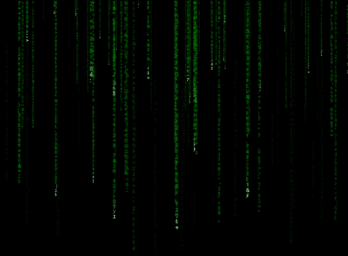

# Code Rain

A matrix style code rain generator created in HTML5 canvas with typescript. Just for fun

## Screenshot



## [Live Demo](https://code-rain.netlify.app/)

## To run

First install dependencies:

```sh
npm i
```

To run locally on `localhost:1234`:s

```sh
npm start
```

To create a production build:

```sh
npm run build
```

To debug on VS Code run locally and start the debugger
